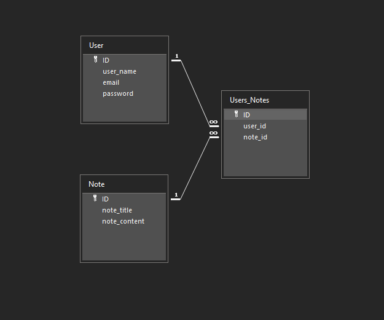

# terminal-one

## Links to Github and Heroku

Github Repository- https://github.com/cblake506/terminal-one

Heroku- https://notedepot.herokuapp.com/

## User Story

```
AS A user
I WANT to log in to a note taking application
SO THAT I can see notes I have already added as well as create new notes, search for exising notes, and delete old notes
```

## Acceptance Criteria

```
GIVEN I load the website
WHEN I enter my log in information or create a new profile
THEN a homepage appears that contains my notes
WHEN I search for a note
THEN I am presented with the note with that title
WHEN I press the share icon
THEN I see a list of available users so that I can share notes among other users
```

## Technologies Used
* bcrypt
* connect-session-sequelize
* dotenv
* express
* express-handlebars
* express-session
* inquirer
* mysql2
* sequelize

## Mock-Up

The following image shows the login page:


The following image shows the home page:


Database blueprint:



